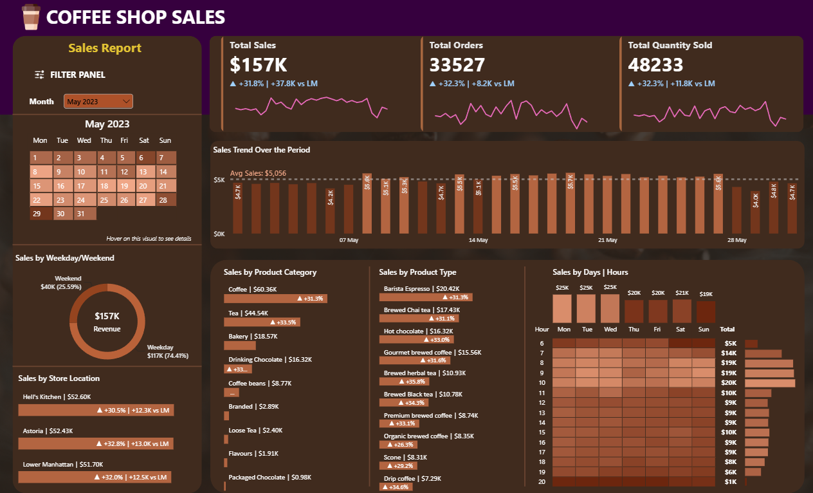

# Coffee Shop Sales Analysis

## 📌 Project Overview

**Project Type:** Guided Project

**Guidance:** This project was completed by closely following a video tutorial. The workflow, analysis approach, SQL queries, and dashboard design were based on the tutorial.

The dataset covers sales transactions from **January 2023 to June 2023**, providing six months of sales data for analysis.

The project analyzes coffee shop sales data using SQL and Power BI to understand sales performance, product category performance, and transaction trends.

---

## 🛠️ Tools Used

- Excel
- MySQL
- Power BI

---

## 🔄 Project Workflow

1. Imported the coffee shop sales data from Excel.
2. Converted the Excel dataset into CSV format.
3. Imported the CSV data into MySQL.
4. Used SQL queries to calculate and validate sales metrics.
5. Connected the data to Power BI.
6. Created measures and visuals in Power BI.
7. Built an interactive coffee shop sales dashboard.
8. Compared selected Power BI results with SQL query results to validate the calculations.

---

## 📊 Dashboard

The Power BI dashboard provides an overview of coffee shop sales performance, including:

- Total Sales
- Total Quantity Sold
- Total Transactions/Orders
- Sales trends over time
- Sales by product category
- Sales by store location
- Product-level sales performance

---

## 📈 Key Insights

- Total sales : $699K
- June has maximum sales($166K), orders(35,352) and quantity sold(50,942).
- Feb has the lowest sales($76K), orders(16,359) and quantity sold(23,550).
- Sales, orders and quantity sold dropped by 6.8%, 5.5% and 5.3% respectively in Feb.
- Highest MoM increase in sales is in May(+31.8%).
- Hell's Kitchen has the highest sales in all the months.
- Coffee is the best-selling product category with sales of $269.95K.
- Barista Espresso is the best-selling product type in the Coffee category with $91.41K sales.
- The quantity sold of coffee is higher than the total orders, which means coffee is ordered in bulk by customers.
- Packaged chocolate is the product category with the lowest sales of $4.41K.
- Sales were highest between 7 AM and 10 AM, indicating that the morning period was the busiest sales window.
- Sales are higher on weekdays compared to weekends.

### Dashboard Preview

---

## 🗄️ SQL Analysis

SQL was used primarily to calculate and validate key metrics from the source data.

The SQL queries were used to check whether the values displayed in the Power BI dashboard matched the corresponding calculations performed directly on the database.

The SQL file containing the queries is available in this repository:

`Project2.sql`

---

## 📁 Files in This Repository

| File | Description |
|------|-------------|
| `Coffee Shop Sales.xlsx` | Original source dataset |
| `Project2.sql` | SQL queries used for analysis and validation |
| `Project2.pbix` | Power BI dashboard |
| `Project2.png` | Dashboard preview |
| `README.md` | Project documentation |

---

## 🎯 Key Learning

This project provided hands-on practice with:

- Importing and preparing data for analysis
- Loading data into MySQL
- Writing SQL aggregation queries
- Validating Power BI calculations using SQL
- Creating Power BI measures and visualizations
- Building an interactive sales dashboard
